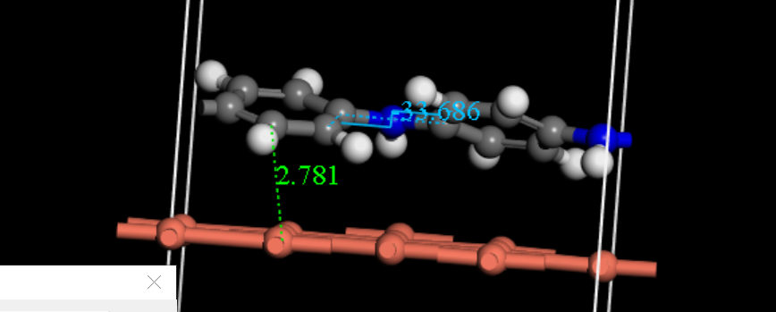
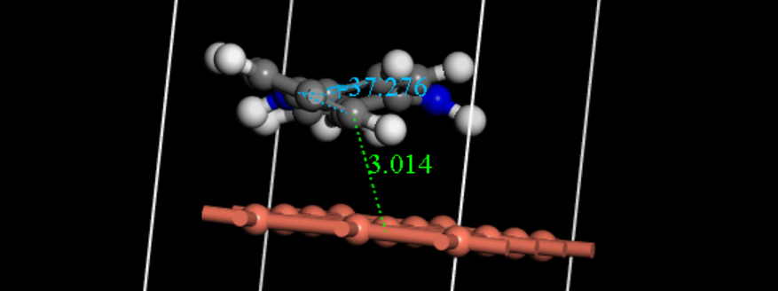
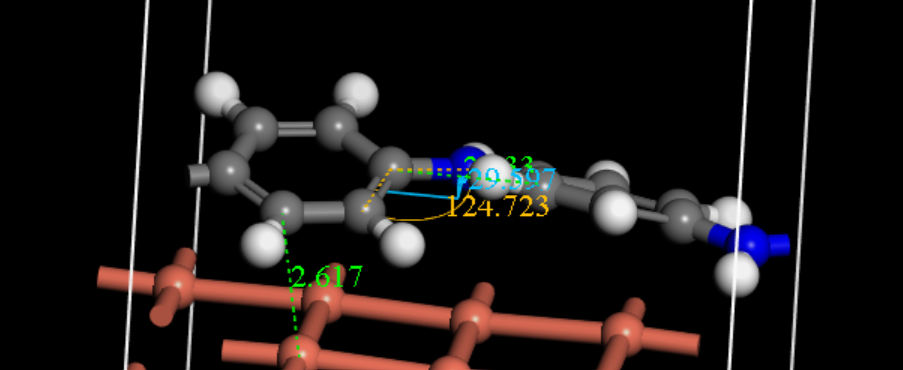
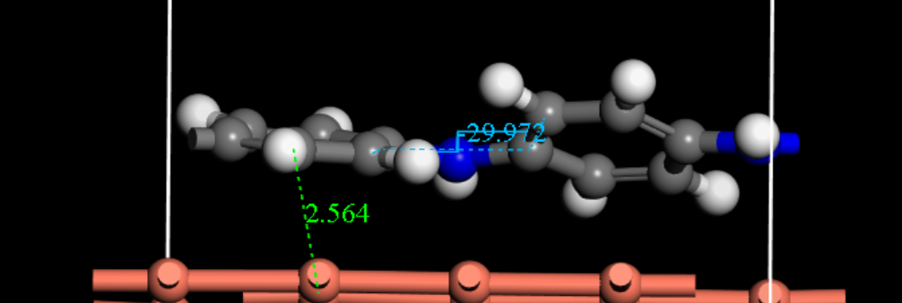
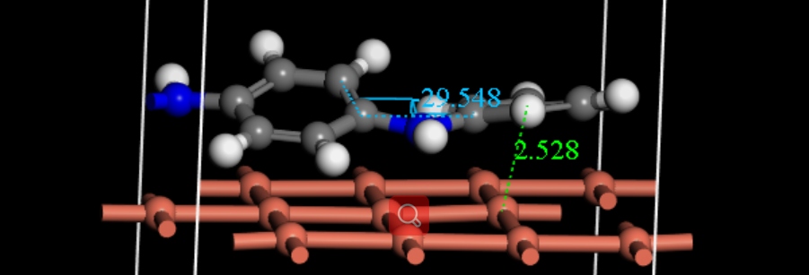

## 以下是在体系中添加2e~移除2e的优化比较

### +2e

### +1e

### 0e

### -1e

### -2e

经过比较，发现去掉1个、2个电子对体系的影响（聚苯胺的共轭程度、聚苯胺和铜表面的亲和度）很小（实际二氧化碳还原中，Cu与电源负极相接，事实上局部富电子）

####令人感到惊奇的是，增加一个电子引起聚苯胺共轭性减弱，聚苯胺和铜表面的亲和度减小，但增加两个电子比起增加一个电子的效应是减弱的（我做了＋1e的三次重复实验，结构数据误差在0.1%）

这说明铜和聚苯胺的作用与电荷量（宏观应表现为电势）有很大关系，接下来建议投入二氧化碳，观察二氧化碳在不同电势下对体系的亲和度，以及二氧化碳的结构改变

