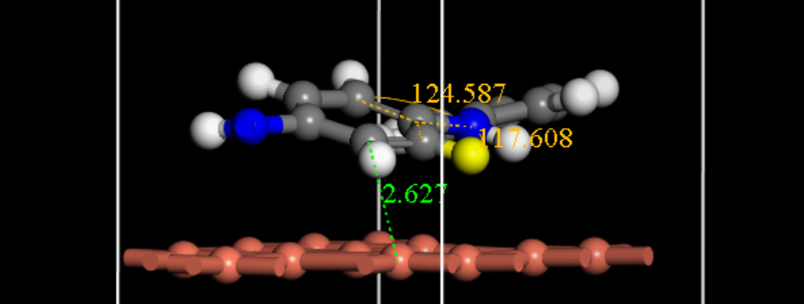
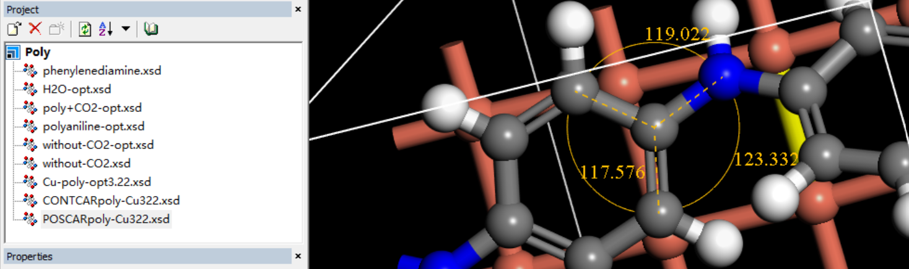
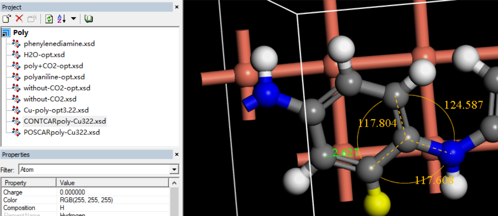
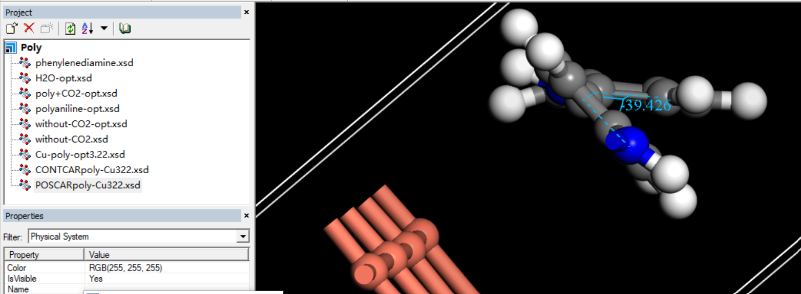
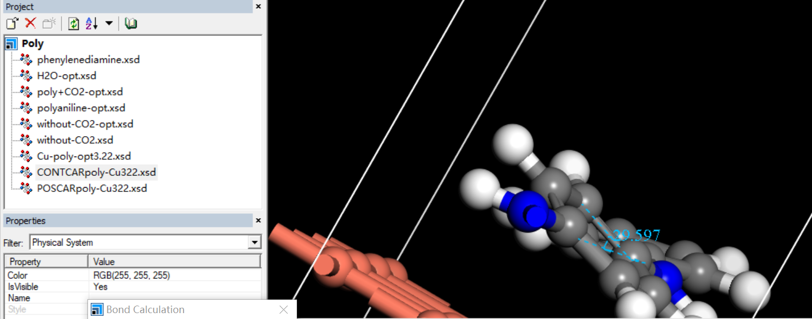
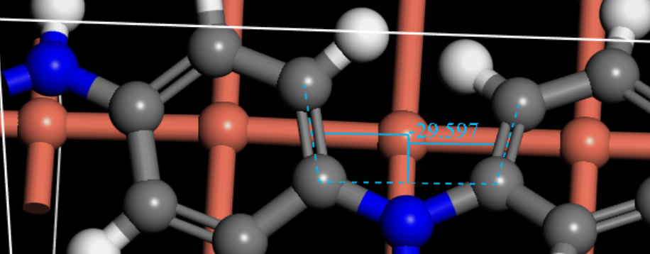
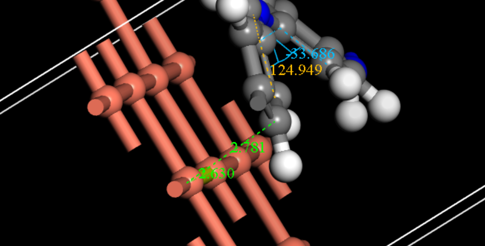

# 0e

### 模拟前

在首次模拟中（投入：4层铜电极，聚苯胺（两基本单元））

### 优化结果
## 1)
聚苯胺整体与铜电极距离拉近（<2.6A），碳/氮原子对铜电极的作用差别不明显

## 2)
聚苯胺分子发生了变化，首先是C-C-N的键角:

POSCAR

CONTCUR

最大的结构变化是苯环平面夹角变化：

POSCAR

CONTCUR

从39度下降到29度

选取的测量原子：

苯环面间夹角变小体现了聚苯胺共轭性增强

针对此现象，目前提出假设是铜与苯环体系作用，引起苯环电子密度下降，N富电子导致向 $sp^2$杂化变化，进而促进了体系的共轭

接下来的实验计划：

抬高铜电极表面电势，研究聚苯胺——铜系统的作用变化。从-1V~1V取6组进行实验比较。

# +2e

聚苯胺整体与铜电极距离比0e更远，苯环平面夹角变大。可以提出电势降低可能会是聚苯胺与铜作用减小